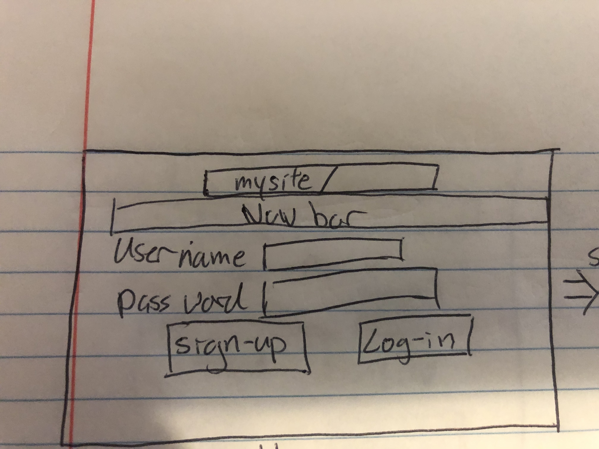
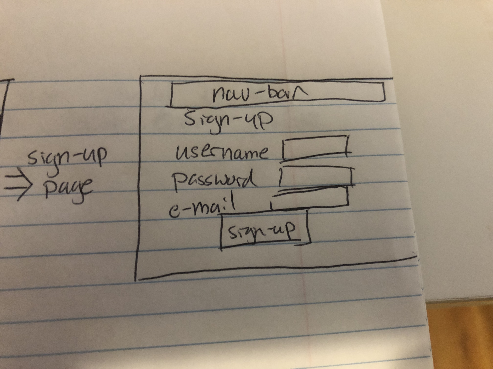
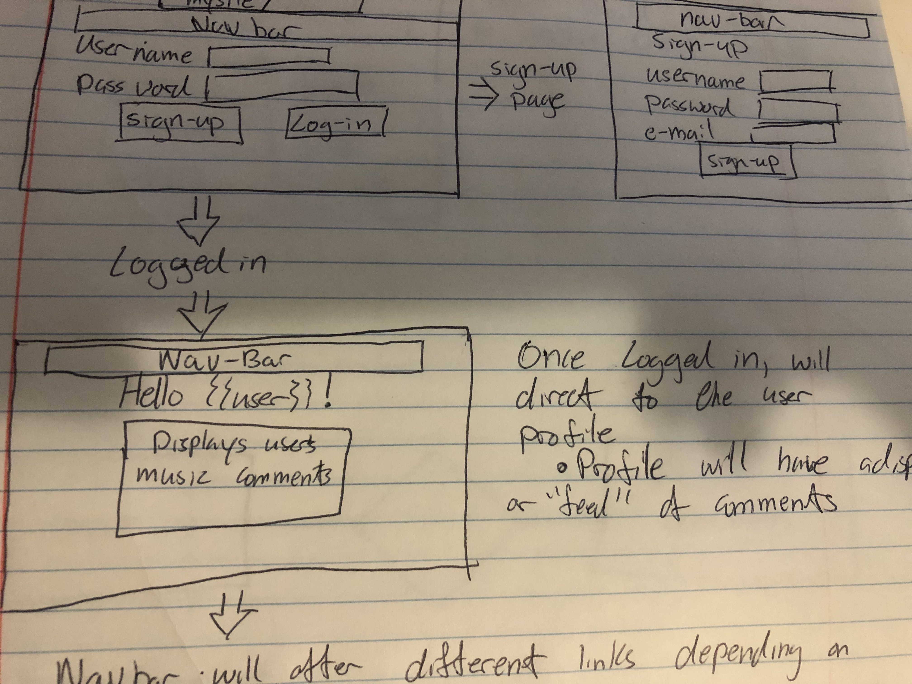
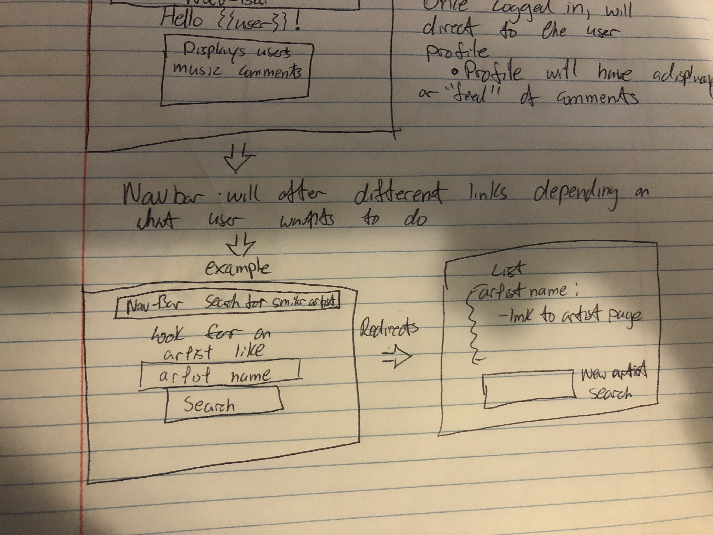
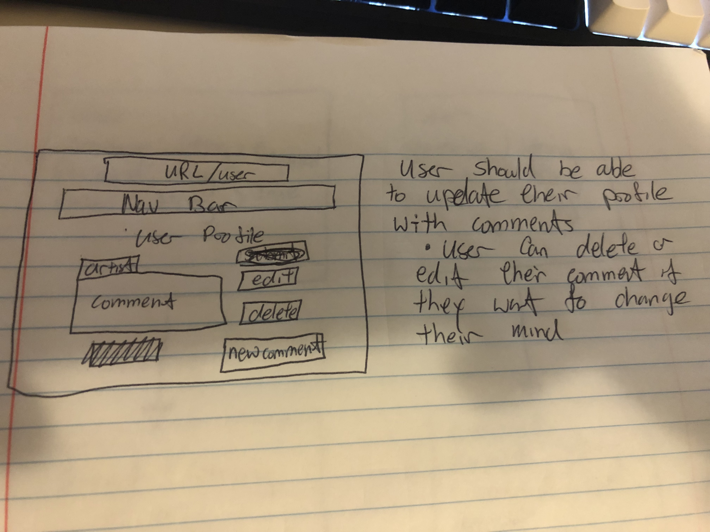
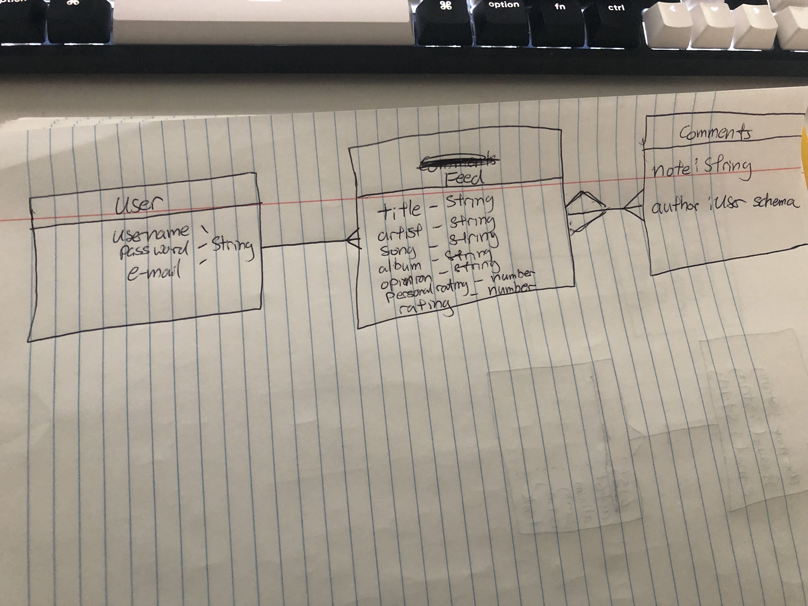

# Project-2-Christopher-Lee

# Christopher-Lee-Project-2

## Find my music
>The premise of this project is to a network for users who enjoy music and have them be able to log information in their profile about certain artist,songs and trends that they like while also helping users with find new songs/artist.

## Technologies used
>Will will be created with CSS/bootstrap, Javascript, Node, mongoose and express

## API utilized
>Project will be built by the help of last.fm API

> https://www.last.fm/api

## Installations needed
> Fork and clone this repo this to your computer

> npm i express mongoose method-override liquid-express-views dotenv morgan node-fetch

> Touch env

>Please register an account from last.fm to obtain an Apikey and remember to store your APIKEY in a safe place!

>PLEASE NOTE, FOR BEST RESULTS OF THIS APP, USERS SHOULD LINK THEIR LAST.FM ACCOUNT TO SPOTIFY/APPLE MUSIC AND SET THEIR USERNAME ON RATEMYMUSIC AS THE SAME USER ON LAST.FM

## User story
> As a user, this application should allow them to be able to search for an artist and the output will be artist similar to this artist. Also, the user should be able to search for albums and songs of an artist. 

> As a user, they should be able to dicuss their music opinions and allow other users to comment on this.

> As a user, they should be able to have a list of artist,songs or albums they want to listen to as well as rating them.

## Route Maps
> Our comment route will display comments in our feed - note, comments are only deletable by the users only.

> Our favorite album route will allow users to search for another users favorite album provided they have their username.

> Our favorite artist route will allow users to search for another users favorite artist provided they have their usernam
e,
> Our favorite song route will allow users to search for another users favorite song provided they have their username.

> Our feed route allows users to interact with each other. Users can post topics of their choosing while other users can comment on the post as well.

>Our home route is the route users will load into after logging in. This will display different charts from top songs, artist and genres. 

>Our list route is user specific and will allow users to add/delete something they want to listen to (such as an album or song of an artist). Users can then decide the rating of the song/album of the artist.

> Our middleware route is neccessary so users can continue with the website experience

> Our profile route is also user specific and will allow users to get their favorite artist,songs and albums. Again, per the installation statement above, to get this to work properly, please link your spotify/apple music to last.fm. Afterwards, your user profile name will need to be the same as the username on last.fm

> Our similar artist route will allow users to search for similar artist depending on their search 

> Our top albums route will allow users to search for an artist's top albums

> Our top songs route will allow users to search for an artist's top songs

> Our users route will force the user to create an account or else no other routes/links will be accessible. 

## MVP of the project
>Project will utilize CRUD and use RESTful routes. 

>Project will utilize the MVC model

>Users should be able to create an account and their login information should be stored in the local server

>Users should be able to navigate through the website allowing them to do certain actions

>At this time, MVP goals would be to allow users to get artist similar to an artist that they inputted/searched, get top albums of an artist and get top songs of an artist

>Index page of this project will be the user profile with a navigation bar so the user can pick what they want to do.

>Show page should list either artist/songs depending on which option they picked (for example, if user selected similar artist, after they input their artist, page should show list of artist similar to the one they inputted)

>User should be able to update their profile and share their thoughts on the artist/song that they searched for

>A delete & edit button should also be available incase the user changes their mind

## Models needed (so far)
> Comment model so users can share their thoughts on artist/songs 

> A feed where users can share their musical opinions

>A list that users can use to keep track of music/artist they want to listen to

## Stretch goals
>Outputted artist should show a link to a some songs of the artist through youtube 

>A comment section where other users can suggest songs/artist

>A like button where other users can like certain artist/songs of the users choice

>Index page of the user's profile should display the users most popular artist and albums and favorite songs.

## Wireframes

>Website will load and give the option for the user to either login to their account or sign-up

>Sign-up page will require the user to input an unique username of choice, password and an unique e-mail

>Logging in will redirect the user to their profile. There will be a navigation bar on top of the website and in the nav-bar, will display various options for user to pick from (see MVPs)

>Example, one option will allow the user to select a musical artist similar to the one that they imputted and from this search, a list of artist similar to the input will be outputted. 

>A search bar will also be displayed incase user wants to search for another artist without reloading the page

>At this user profile, they can give opinions on a new artist/song that they discovered and give their opinion/comments. User will be allowed to edit/delete their comments in case they change their minds.

## ERD

